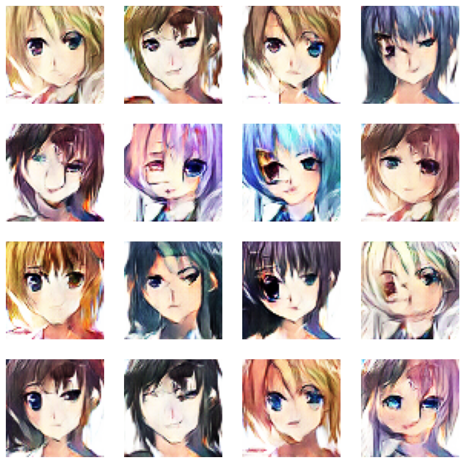
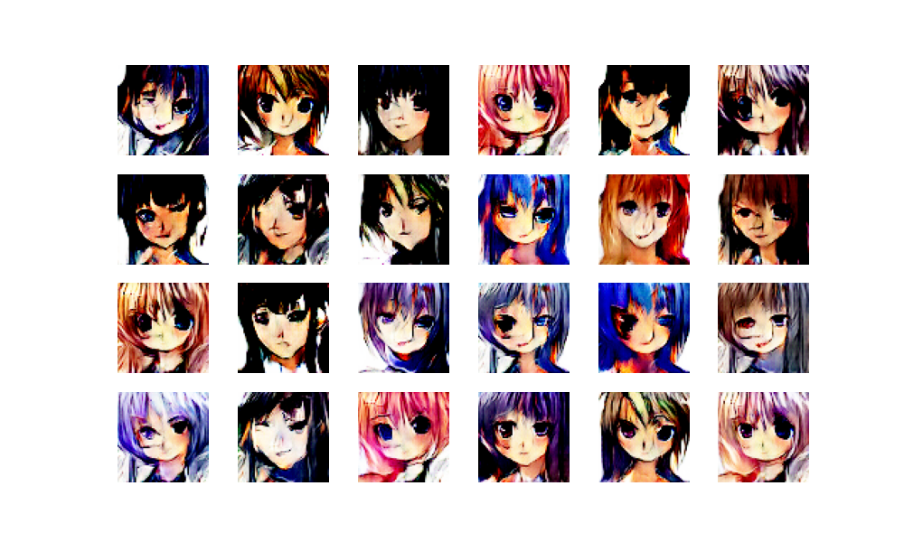

# DCGAN Anime Face Generation

This folder contains a Jupyter notebook for generating anime faces using a Deep Convolutional Generative Adversarial Network (DCGAN).

## Overview

In this project, I demonstrate how to create anime-style faces using a DCGAN, a type of generative adversarial network specifically designed for generating images. DCGANs are a type of generative model that can create realistic images from random noise. Anime face generation has gained popularity in the field of computer vision and artificial intelligence, and this notebook provides a step-by-step guide to the process. The model has been trained on a dataset of anime faces and can generate new, unique anime faces.

## Features

- Implementation of a DCGAN for anime face generation.
- Training the model on a dataset of anime faces.
- Generating new, synthetic anime faces.

## Result

