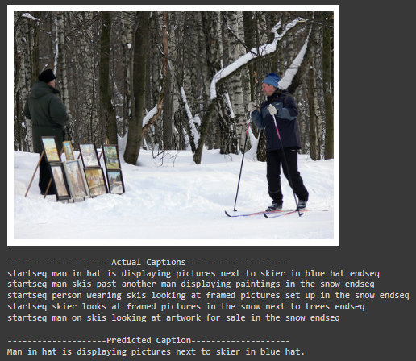
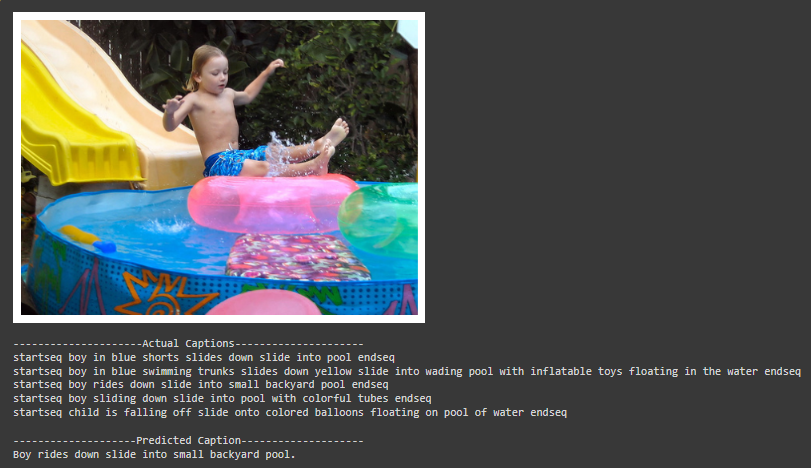
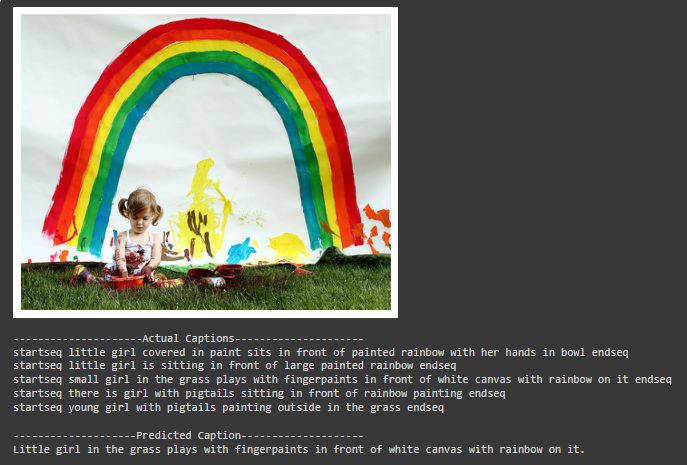
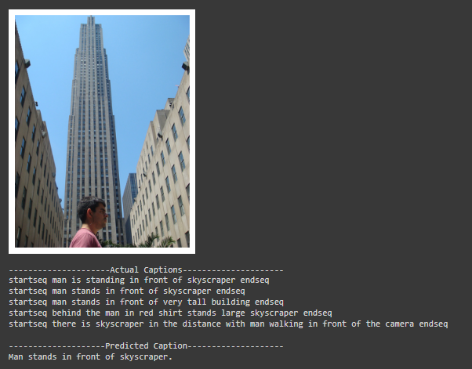
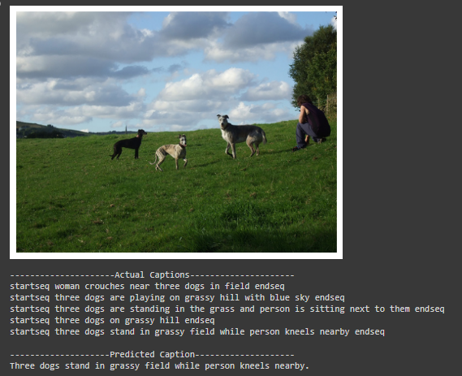

# Image Caption Generator

In this project, I build a model to generate textual captions for images using deep learning techniques.

## Overview

In this project, I perform the following tasks:

1. Feature Extraction:
   - Utilize a pre-trained Xception model to extract image features.

2. Caption Preprocessing:
   - Clean and preprocess image captions.
   - Tokenize and create a vocabulary.

3. Model Architecture:
   - Design a deep learning model for image caption generation.
   - Implement an attention mechanism for improved caption generation.

4. Caption Generation:
   - Generate image captions using beam search and standard prediction.

5. Evaluation:
   - Evaluate the generated captions using BLEU-1 and BLEU-2 scores.

## Results

|  Model | BLEU-1 | BLEU-2 |
|----------|----------|----------|
| My Captioning Model | 0.514265 | 0.253775 |

