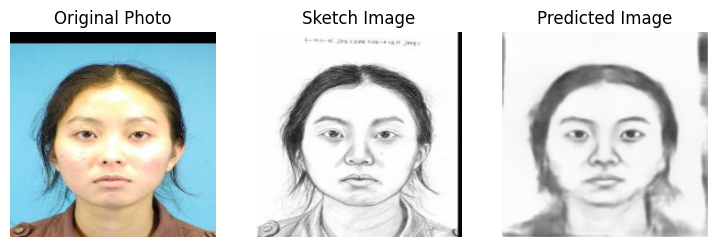
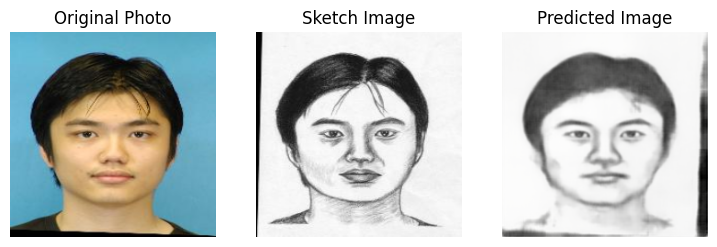

# Photo-to-Sketch Autoencoder

This folder contains a Jupyter notebook for converting photos to sketches using an Autoencoder.

## Overview

In this project, I demonstrate how to utilize an Autoencoder to transform photos into sketches. Autoencoders are neural network architectures that can learn to encode and decode data, making them suitable for various image transformation tasks.

## Results

