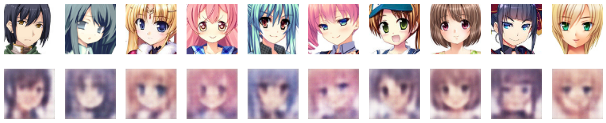
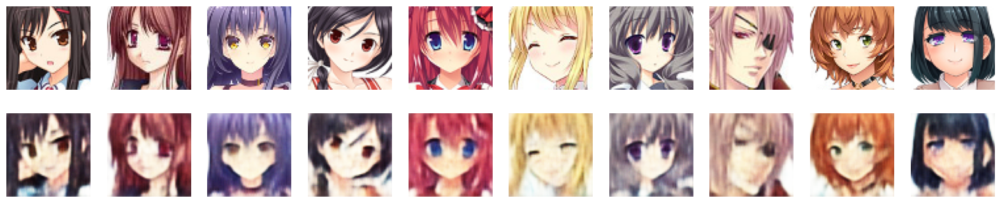
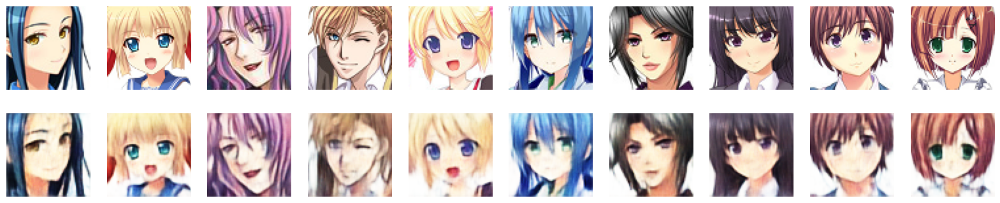
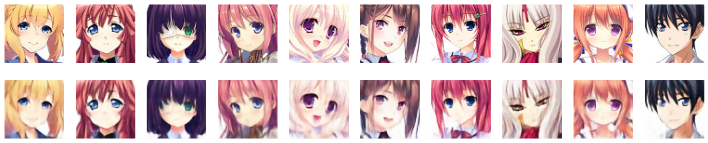
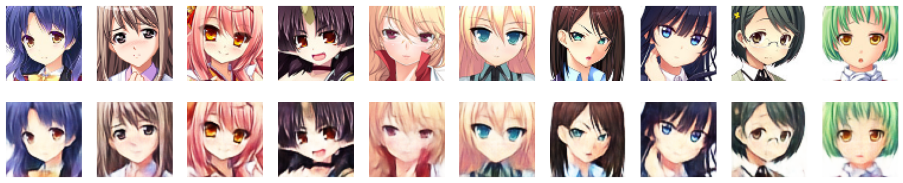

# VAE Anime Face Generation

This folder contains a Jupyter notebook for generating anime-style faces using a Variational Autoencoder (VAE).

## Overview

In this notebook, I demonstrate the process of generating anime faces using a Variational Autoencoder. The VAE is a generative model that can produce high-quality anime face images. The VAE learns a latent representation of the data and can generate novel anime faces by sampling from this latent space. This repository provides a step-by-step guide on how to train the VAE and generate anime faces.

## Results

The generated images showcase the progression of the VAE in creating anime faces as training advances. You can compare the quality of the generated faces at different stages of training.

At Epoch 1:

At Epoch 10:

At Epoch 20:

At Epoch 30:

At Epoch 40:

At Epoch 50:

